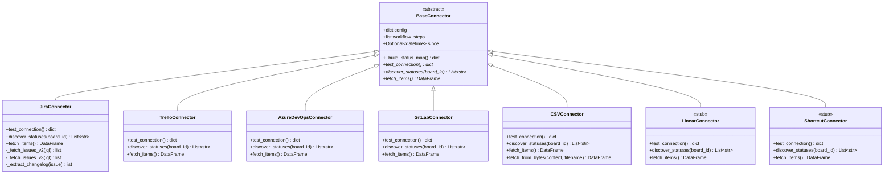

# Connector Class Hierarchy

```mermaid
classDiagram
    class BaseConnector {
        <<abstract>>
        +dict config
        +list workflow_steps
        +Optional~datetime~ since
        +_build_status_map() dict
        +test_connection()* dict
        +discover_statuses(board_id)* List~str~
        +fetch_items()* DataFrame
    }

    class JiraConnector {
        +test_connection() dict
        +discover_statuses(board_id) List~str~
        +fetch_items() DataFrame
        -_fetch_issues_v2(jql) list
        -_fetch_issues_v3(jql) list
        -_extract_changelog(issue) list
    }

    class TrelloConnector {
        +test_connection() dict
        +discover_statuses(board_id) List~str~
        +fetch_items() DataFrame
    }

    class AzureDevOpsConnector {
        +test_connection() dict
        +discover_statuses(board_id) List~str~
        +fetch_items() DataFrame
    }

    class GitLabConnector {
        +test_connection() dict
        +discover_statuses(board_id) List~str~
        +fetch_items() DataFrame
    }

    class CSVConnector {
        +test_connection() dict
        +discover_statuses(board_id) List~str~
        +fetch_items() DataFrame
        +fetch_from_bytes(content, filename) DataFrame
    }

    class LinearConnector {
        <<stub>>
        +test_connection() dict
        +discover_statuses(board_id) List~str~
        +fetch_items() DataFrame
    }

    class ShortcutConnector {
        <<stub>>
        +test_connection() dict
        +discover_statuses(board_id) List~str~
        +fetch_items() DataFrame
    }

    BaseConnector <|-- JiraConnector
    BaseConnector <|-- TrelloConnector
    BaseConnector <|-- AzureDevOpsConnector
    BaseConnector <|-- GitLabConnector
    BaseConnector <|-- CSVConnector
    BaseConnector <|-- LinearConnector
    BaseConnector <|-- ShortcutConnector
```
