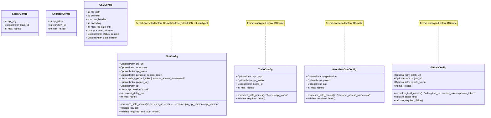

# Connector Configuration Pydantic Models

```mermaid
classDiagram
    class JiraConfig {
        +Optional~str~ jira_url
        +Optional~str~ username
        +Optional~str~ api_token
        +Optional~str~ personal_access_token
        +Literal auth_type "api_token|personal_access_token|oauth"
        +Optional~str~ project_key
        +Optional~str~ jql
        +Literal api_version "v2|v3"
        +int request_delay_ms
        +int max_retries
        +normalize_field_names() "url→jira_url, email→username, jira_api_version→api_version"
        +validate_jira_url()
        +validate_required_and_auth_token()
    }

    class TrelloConfig {
        +Optional~str~ api_key
        +Optional~str~ api_token
        +Optional~str~ board_id
        +int max_retries
        +normalize_field_names() "token→api_token"
        +validate_required_fields()
    }

    class AzureDevOpsConfig {
        +Optional~str~ organization
        +Optional~str~ project
        +Optional~str~ pat
        +int max_retries
        +normalize_field_names() "personal_access_token→pat"
        +validate_required_fields()
    }

    class GitLabConfig {
        +Optional~str~ gitlab_url
        +Optional~str~ project_id
        +Optional~str~ private_token
        +int max_retries
        +normalize_field_names() "url→gitlab_url, access_token→private_token"
        +validate_gitlab_url()
        +validate_required_fields()
    }

    class LinearConfig {
        +str api_key
        +Optional~str~ team_id
        +int max_retries
    }

    class ShortcutConfig {
        +str api_token
        +str workflow_id
        +int max_retries
    }

    class CSVConfig {
        +str file_path
        +str delimiter
        +bool has_header
        +str encoding
        +int max_file_size_mb
        +List~str~ date_columns
        +Optional~str~ status_column
        +Optional~str~ date_column
    }

    note for JiraConfig "Fernet-encrypted before DB write\n(EncryptedJSON column type)"
    note for TrelloConfig "Fernet-encrypted before DB write"
    note for AzureDevOpsConfig "Fernet-encrypted before DB write"
    note for GitLabConfig "Fernet-encrypted before DB write"
```
