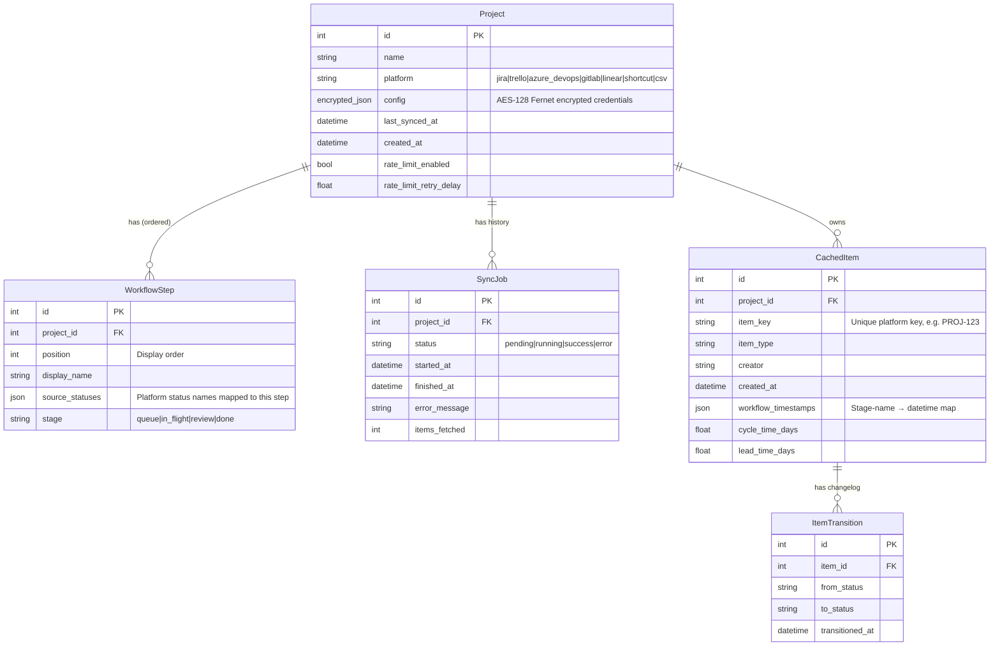

# Data Model (Entity-Relationship Diagram)

```mermaid
erDiagram
    Project {
        int id PK
        string name
        string platform "jira|trello|azure_devops|gitlab|linear|shortcut|csv"
        encrypted_json config "AES-128 Fernet encrypted credentials"
        datetime last_synced_at
        datetime created_at
        bool rate_limit_enabled
        float rate_limit_retry_delay
    }

    WorkflowStep {
        int id PK
        int project_id FK
        int position "Display order"
        string display_name
        json source_statuses "Platform status names mapped to this step"
        string stage "queue|in_flight|review|done"
    }

    SyncJob {
        int id PK
        int project_id FK
        string status "pending|running|success|error"
        datetime started_at
        datetime finished_at
        string error_message
        int items_fetched
    }

    CachedItem {
        int id PK
        int project_id FK
        string item_key "Unique platform key, e.g. PROJ-123"
        string item_type
        string creator
        datetime created_at
        json workflow_timestamps "Stage-name → datetime map"
        float cycle_time_days
        float lead_time_days
    }

    ItemTransition {
        int id PK
        int item_id FK
        string from_status
        string to_status
        datetime transitioned_at
    }

    Project ||--o{ WorkflowStep : "has (ordered)"
    Project ||--o{ SyncJob : "has history"
    Project ||--o{ CachedItem : "owns"
    CachedItem ||--o{ ItemTransition : "has changelog"
```
