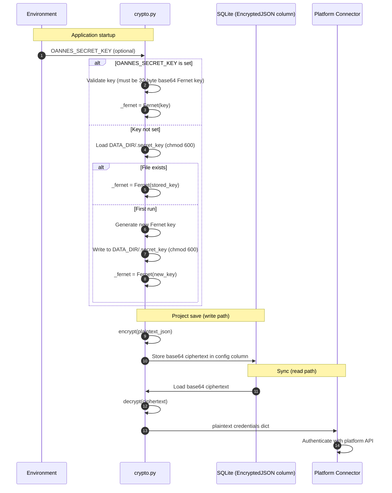

# Credential Encryption Flow

```mermaid
sequenceDiagram
    autonumber
    participant Env as Environment
    participant Crypto as crypto.py
    participant DB as SQLite (EncryptedJSON column)
    participant Connector as Platform Connector

    Note over Env,Crypto: Application startup
    Env->>Crypto: OANNES_SECRET_KEY (optional)
    alt OANNES_SECRET_KEY is set
        Crypto->>Crypto: Validate key (must be 32-byte base64 Fernet key)
        Crypto->>Crypto: _fernet = Fernet(key)
    else Key not set
        Crypto->>Crypto: Load DATA_DIR/.secret_key (chmod 600)
        alt File exists
            Crypto->>Crypto: _fernet = Fernet(stored_key)
        else First run
            Crypto->>Crypto: Generate new Fernet key
            Crypto->>Crypto: Write to DATA_DIR/.secret_key (chmod 600)
            Crypto->>Crypto: _fernet = Fernet(new_key)
        end
    end

    Note over Crypto,DB: Project save (write path)
    Crypto->>Crypto: encrypt(plaintext_json)
    Crypto->>DB: Store base64 ciphertext in config column

    Note over DB,Connector: Sync (read path)
    DB->>Crypto: Load base64 ciphertext
    Crypto->>Crypto: decrypt(ciphertext)
    Crypto->>Connector: plaintext credentials dict
    Connector->>Connector: Authenticate with platform API
```
