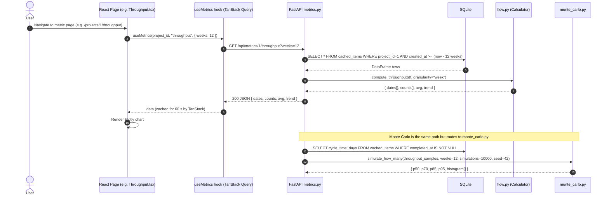

# Metrics Request Sequence

Covers the full flow from the user navigating to a metric page to the chart rendering.

```mermaid
sequenceDiagram
    autonumber
    actor User
    participant UI as React Page (e.g. Throughput.tsx)
    participant Hook as useMetrics hook (TanStack Query)
    participant API as FastAPI metrics.py
    participant DB as SQLite
    participant Flow as flow.py (Calculator)
    participant MC as monte_carlo.py

    User->>UI: Navigate to metric page (e.g. /projects/1/throughput)
    UI->>Hook: useMetrics(project_id, "throughput", { weeks: 12 })
    Hook->>API: GET /api/metrics/1/throughput?weeks=12

    API->>DB: SELECT * FROM cached_items WHERE project_id=1 AND created_at >= (now - 12 weeks)
    DB-->>API: DataFrame rows

    API->>Flow: compute_throughput(df, granularity="week")
    Flow-->>API: { dates[], counts[], avg, trend }

    API-->>Hook: 200 JSON { dates, counts, avg, trend }
    Hook-->>UI: data (cached for 60 s by TanStack)
    UI->>UI: Render Plotly chart

    Note over API,MC: Monte Carlo is the same path but routes to monte_carlo.py
    API->>DB: SELECT cycle_time_days FROM cached_items WHERE completed_at IS NOT NULL
    API->>MC: simulate_how_many(throughput_samples, weeks=12, simulations=10000, seed=42)
    MC-->>API: { p50, p70, p85, p95, histogram[] }
```
