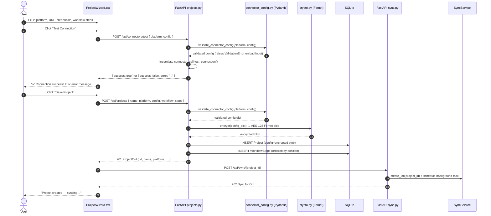

# Project Creation Sequence

Covers the full flow from the user filling in the Project Wizard to the first sync.

```mermaid
sequenceDiagram
    autonumber
    actor User
    participant Wizard as ProjectWizard.tsx
    participant API as FastAPI projects.py
    participant Validator as connector_config.py (Pydantic)
    participant Crypto as crypto.py (Fernet)
    participant DB as SQLite
    participant SyncAPI as FastAPI sync.py
    participant SyncSvc as SyncService

    User->>Wizard: Fill in platform, URL, credentials, workflow steps
    User->>Wizard: Click "Test Connection"
    Wizard->>API: POST /api/connectors/test { platform, config }
    API->>Validator: validate_connector_config(platform, config)
    Validator-->>API: validated config (raises ValidationError on bad input)
    API->>API: Instantiate connector, call test_connection()
    API-->>Wizard: { success: true } or { success: false, error: "..." }
    Wizard-->>User: "✅ Connection successful" or error message

    User->>Wizard: Click "Save Project"
    Wizard->>API: POST /api/projects { name, platform, config, workflow_steps }
    API->>Validator: validate_connector_config(platform, config)
    Validator-->>API: validated config dict
    API->>Crypto: encrypt(config_dict) → AES-128 Fernet blob
    Crypto-->>API: encrypted blob
    API->>DB: INSERT Project (config=encrypted blob)
    API->>DB: INSERT WorkflowSteps (ordered by position)
    API-->>Wizard: 201 ProjectOut { id, name, platform, … }

    Wizard->>SyncAPI: POST /api/sync/{project_id}
    SyncAPI->>SyncSvc: create_job(project_id) + schedule background task
    SyncAPI-->>Wizard: 202 SyncJobOut
    Wizard-->>User: "Project created — syncing…"
```
