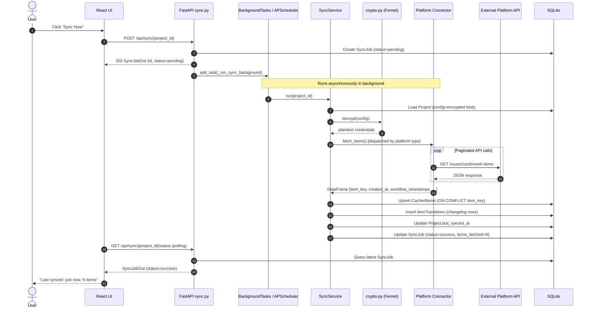

# Sync Flow Sequence

Covers both user-triggered sync (POST /api/sync/{id}) and APScheduler automatic sync.

```mermaid
sequenceDiagram
    autonumber
    actor User
    participant UI as React UI
    participant API as FastAPI sync.py
    participant BG as BackgroundTasks / APScheduler
    participant SyncSvc as SyncService
    participant Crypto as crypto.py (Fernet)
    participant Connector as Platform Connector
    participant Platform as External Platform API
    participant DB as SQLite

    User->>UI: Click "Sync Now"
    UI->>API: POST /api/sync/{project_id}
    API->>DB: Create SyncJob (status=pending)
    API-->>UI: 202 SyncJobOut (id, status=pending)
    API->>BG: add_task(_run_sync_background)

    Note over BG,Connector: Runs asynchronously in background

    BG->>SyncSvc: run(project_id)
    SyncSvc->>DB: Load Project (config=encrypted blob)
    SyncSvc->>Crypto: decrypt(config)
    Crypto-->>SyncSvc: plaintext credentials

    SyncSvc->>Connector: fetch_items() [dispatched by platform type]
    loop Paginated API calls
        Connector->>Platform: GET issues/cards/work-items
        Platform-->>Connector: JSON response
    end
    Connector-->>SyncSvc: DataFrame [item_key, created_at, workflow_timestamps, …]

    SyncSvc->>DB: Upsert CachedItems (ON CONFLICT item_key)
    SyncSvc->>DB: Insert ItemTransitions (changelog rows)
    SyncSvc->>DB: Update Project.last_synced_at
    SyncSvc->>DB: Update SyncJob (status=success, items_fetched=N)

    UI->>API: GET /api/sync/{project_id}/status (polling)
    API->>DB: Query latest SyncJob
    API-->>UI: SyncJobOut (status=success)
    UI-->>User: "Last synced: just now, N items"
```
