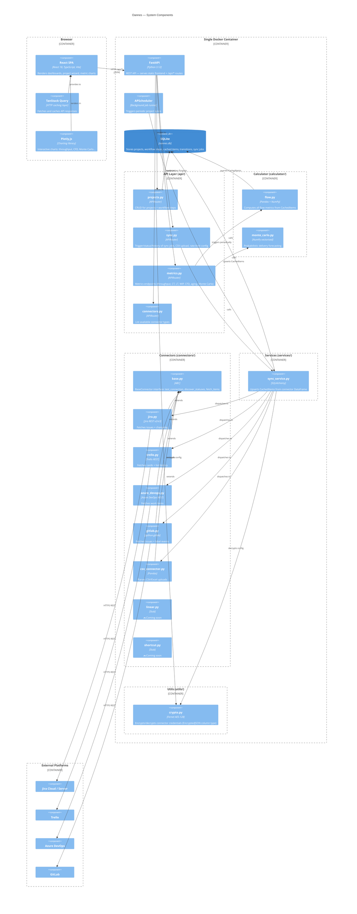

# System Component Diagram

```mermaid
C4Component
    title Oannes — System Components

    Container_Boundary(browser, "Browser") {
        Component(ui, "React SPA", "React 18, TypeScript, Vite", "Renders dashboards, project wizard, metric charts")
        Component(tanstack, "TanStack Query", "HTTP caching layer", "Fetches and caches API responses")
        Component(plotly, "Plotly.js", "Charting library", "Interactive charts: throughput, CFD, Monte Carlo…")
    }

    Container_Boundary(docker, "Single Docker Container") {
        Component(fastapi, "FastAPI", "Python 3.12", "REST API — serves static frontend + /api/* routes")
        Component(scheduler, "APScheduler", "Background job runner", "Triggers periodic project syncs")

        Container_Boundary(api_layer, "API Layer (api/)") {
            Component(projects_api, "projects.py", "APIRouter", "CRUD for projects + workflow steps")
            Component(sync_api, "sync.py", "APIRouter", "Trigger/status/history of sync jobs, CSV upload, rate-limit config")
            Component(metrics_api, "metrics.py", "APIRouter", "Metrics endpoints (throughput, CT, LT, WIP, CFD, aging, Monte Carlo)")
            Component(connectors_api, "connectors.py", "APIRouter", "List available connector types")
        }

        Container_Boundary(calc_layer, "Calculator (calculator/)") {
            Component(flow, "flow.py", "Pandas + NumPy", "Computes all flow metrics from CachedItems")
            Component(monte_carlo, "monte_carlo.py", "NumPy vectorised", "Probabilistic delivery forecasting")
        }

        Container_Boundary(connector_layer, "Connectors (connectors/)") {
            Component(base, "base.py", "ABC", "BaseConnector interface: test_connection, discover_statuses, fetch_items")
            Component(jira_c, "jira.py", "Jira REST v2/v3", "Fetches issues + changelog")
            Component(trello_c, "trello.py", "Trello REST", "Fetches cards + list history")
            Component(ado_c, "azure_devops.py", "Azure DevOps REST", "Fetches work items")
            Component(gitlab_c, "gitlab.py", "python-gitlab", "Fetches issues + label events")
            Component(csv_c, "csv_connector.py", "Pandas", "Parses CSV/Excel uploads")
            Component(linear_c, "linear.py", "Stub", "🔜 Coming soon")
            Component(shortcut_c, "shortcut.py", "Stub", "🔜 Coming soon")
        }

        Container_Boundary(service_layer, "Services (services/)") {
            Component(sync_svc, "sync_service.py", "SQLAlchemy", "Upserts CachedItems from connector DataFrame")
        }

        Container_Boundary(utils_layer, "Utils (utils/)") {
            Component(crypto, "crypto.py", "Fernet AES-128", "Encrypts/decrypts connector credentials (EncryptedJSON column type)")
        }

        ContainerDb(sqlite, "SQLite", "oannes.db", "Stores projects, workflow steps, cached items, transitions, sync jobs")
    }

    Container_Boundary(external, "External Platforms") {
        Component(jira_ext, "Jira Cloud / Server", "", "")
        Component(trello_ext, "Trello", "", "")
        Component(ado_ext, "Azure DevOps", "", "")
        Component(gitlab_ext, "GitLab", "", "")
    }

    Rel(ui, fastapi, "HTTP /api/*", "JSON")
    Rel(tanstack, ui, "provides to")
    Rel(plotly, ui, "renders in")

    Rel(fastapi, projects_api, "routes to")
    Rel(fastapi, sync_api, "routes to")
    Rel(fastapi, metrics_api, "routes to")
    Rel(fastapi, connectors_api, "routes to")

    Rel(metrics_api, flow, "calls")
    Rel(metrics_api, monte_carlo, "calls")
    Rel(flow, sqlite, "queries CachedItems")

    Rel(sync_api, sync_svc, "calls")
    Rel(scheduler, sync_svc, "triggers periodically")
    Rel(sync_svc, jira_c, "dispatches to")
    Rel(sync_svc, trello_c, "dispatches to")
    Rel(sync_svc, ado_c, "dispatches to")
    Rel(sync_svc, gitlab_c, "dispatches to")
    Rel(sync_svc, csv_c, "dispatches to")
    Rel(sync_svc, sqlite, "upserts CachedItems")

    Rel(jira_c, base, "extends")
    Rel(trello_c, base, "extends")
    Rel(ado_c, base, "extends")
    Rel(gitlab_c, base, "extends")
    Rel(csv_c, base, "extends")

    Rel(jira_c, jira_ext, "HTTPS REST")
    Rel(trello_c, trello_ext, "HTTPS REST")
    Rel(ado_c, ado_ext, "HTTPS REST")
    Rel(gitlab_c, gitlab_ext, "HTTPS REST")

    Rel(projects_api, sqlite, "reads/writes Projects")
    Rel(projects_api, crypto, "encrypts config")
    Rel(sync_svc, crypto, "decrypts config")
```
