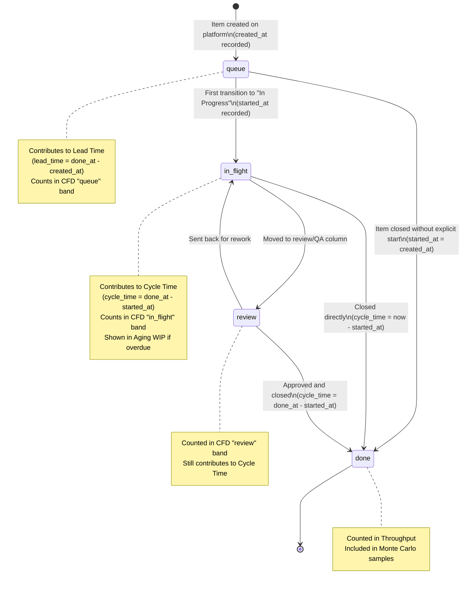

# Work Item Stage State Machine

Each `CachedItem` progresses through workflow stages. Stage names are defined per-project
via `WorkflowStep.stage` and can be customised in the Project Wizard.

```mermaid
stateDiagram-v2
    [*] --> queue : Item created on platform\n(created_at recorded)

    queue --> in_flight : First transition to "In Progress"\n(started_at recorded)
    queue --> done : Item closed without explicit start\n(started_at = created_at)

    in_flight --> review : Moved to review/QA column
    in_flight --> done : Closed directly\n(cycle_time = now - started_at)

    review --> in_flight : Sent back for rework
    review --> done : Approved and closed\n(cycle_time = done_at - started_at)

    done --> [*]

    note right of queue
        Contributes to Lead Time
        (lead_time = done_at - created_at)
        Counts in CFD "queue" band
    end note

    note right of in_flight
        Contributes to Cycle Time
        (cycle_time = done_at - started_at)
        Counts in CFD "in_flight" band
        Shown in Aging WIP if overdue
    end note

    note right of review
        Counted in CFD "review" band
        Still contributes to Cycle Time
    end note

    note right of done
        Counted in Throughput
        Included in Monte Carlo samples
    end note
```
